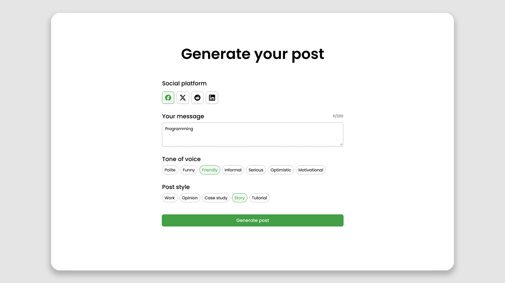

# AI Post Generator Project

AI tool for crafting tailored posts across social platforms.

## Hello to [BigDevSoon](https://bigdevsoon.me/) 👋

Create code that matters! 🤩

Level up your coding skills by building real-world projects with professional designs.

## Project brief

Embark on an enriching journey with **AI Post Generator**, where user intent meets the precision of AI-driven content generation. This application offers a hands-on experience in crafting content for social media, utilizing the prowess of OpenAI.

### What you will learn

- **API Configuration and Mastery**: Dive into the OpenAI API, understanding its structure and functionality. Grasp the art of crafting meaningful prompts to guide AI in generating the desired content.

- **Interactive UI Development**: Engage in creating an intuitive user interface that responds to various user interactions, from simple button presses to dynamic content generation.

- **Advanced Content Presentation**: Learn to seamlessly blend user inputs with AI-generated content, ensuring smooth transitions with tools like the Typist animation, and master the nuances of data validation.

- **Understanding AI Prompts**: Deepen your grasp of how AI interprets user commands, and hone your skills in refining prompts to obtain the most accurate and relevant responses.

### Requirements

- Research and integrate with the [OpenAI API](https://platform.openai.com/docs/introduction), focusing on understanding the importance of prompts. Ensure the API key is stored securely as an environment variable.
- Implement a central layout according to the provided Figma design, prominently displaying the title "Generate your post". Ensure the UI is responsive across various devices.
- Add selector icons for each social platform, enhancing interactivity by allowing only one platform selection at a time.
- Develop a message text input that permits users to input up to 200 characters and showcases an active state with a live character count.
- Introduce two separate selectors: "Tone of voice" and "Post style", ensuring users can choose one option from each category.
- Integrate a "Generate Post" button that remains disabled until all prior selections are completed. Once activated and pressed, it should take the user to the "Your generated post" view, making an API call with a dynamically crafted prompt based on the provided input.
- Change the title to "Your generated post" and add a loading phase utilizing the "Typist" animation. Start by showing just the animated typing cursor, and upon receiving the API's content, initiate the typewriter effect. Additionally, display non-functional, disabled "Back to Generator" and "Regenerate" buttons.
- Upon content being loaded, enable both buttons and copy icon next to the text. The "Back to Generator" button should redirect users to the prior view with preserved input, while the "Regenerate" button should restart the content generation process.

## Project assets

Depending on the mode you pick, different assets will be available:

**Freerun Mode**: In this mode (costs 1 BigToken), most of the Frontend cards you will work on come with a unique screenshot reflecting the card's requirements. These visual aids guide you toward a closer representation of the project's intended design and specifications.

**Speedrun Mode**: Access general project assets and the starter code. This mode swiftly challenges you, emphasizing the coding process over strict design adherence.

**Additional Resource – Figma Design**: For those seeking a deeper dive, you have the option to download the Figma design (costs 3 BigTokens) in either Speedrun or Freerun mode. This design contains all visual states and a comprehensive Design System, ensuring your implementation is both consistent and on point. The "Download Figma design" button is available whenever you decide to elevate your project experience.

## How to start

1. Head over to the [project page](https://app.bigdevsoon.me/projects/just-weather). Choose between Freerun or Speedrun mode, then click either the "Start Freerun" or "Start Speedrun" button.
2. Familiarize yourself with the provided images in the "Assets" section. Optionally, you can download the starter code for the initial boilerplate.
3. For a full project experience, consider downloading the Figma design.
4. Dive deep into this `README.md`. It covers everything from implementation hints and project guidelines to how to submit your final piece.
5. Get coding! Let your passion for learning and growing as a Big Developer fuel your journey. 🔥

## Implementation

Embrace the freedom of choice in your implementation. Whether you're using familiar tools or experimenting with new ones, make this project uniquely yours. Use any combination of languages, libraries, or frameworks as you desire. Push boundaries, learn, and make something to be proud of. 😊

**Setup & Environment**: You can use both [Glitch](https://glitch.com/), a cloud-based editor perfect for quick starts and live previews, or [GitHub](https://github.com/) to lay the groundwork. [GitHub](https://github.com/) is an excellent choice for those building a portfolio or keen on mastering Git. If you're new to coding, consider beginning with [Glitch](https://glitch.com/) to bypass the initial Git learning curve.

No matter your platform choice, feel free to overwrite repository files to suit your project structure. We've included a set of starter files and an `assets` folder, extracted from the design, to streamline your setup process.

**Structuring your project**: Whether you're pacing yourself with Freerun's card-by-card approach or diving into the deep end with Speedrun, it's essential to segment your work. Break down the project into smaller components or sections and plan the implementation based on the provided designs.

### Getting help when stuck

**Community**: Reach out to our "Community questions" section in the project for support. Remember, connecting your Discord account grants you 1 BigToken on your first connection!

**ChatGPT**: For intricate, technical concerns, the "ChatGPT" section in the project is at your disposal. A BIG subscription is required to access this feature.

## Review

Before finalizing your project, take a moment to review your work. This process ensures the quality of your code and fosters self-growth:

1. **Self-Review**: Start by examining your own code. Use this time for introspection, checking that you've adhered to the project's goals and requirements.

2. **Community review**: If you're looking for external opinions, our community is a great place to turn. Fellow developers can offer fresh perspectives, pointing out areas for refinement.

3. **ChatGPT review**: Alternatively, if you're after technical insights, the "ChatGPT" section in the project offers in-depth analysis. This AI-powered tool pinpoints areas of improvement and helps to elevate your code quality.

## Guidelines

1. **Project Planning**: Start by reviewing the design and requirements. Get a good grasp of the project's scope. This foresight can save you time and rework later on.

2. **Design Fidelity**: Strive for a close match with the design. However, creative variations are welcome, especially if they enhance UX/UI. Tools like [PixelParallel](https://chrome.google.com/webstore/detail/pixelparallel-by-htmlburg/iffnoibnepbcloaaagchjonfplimpkob?hl=en) can assist in ensuring design accuracy.

3. **Code Quality**: Ensure your code is clean and efficient. Extensions like [Prettier](https://marketplace.visualstudio.com/items?itemName=esbenp.prettier-vscode) and [ESLint](https://marketplace.visualstudio.com/items?itemName=dbaeumer.vscode-eslint), for [VSCode](https://code.visualstudio.com/) users, are invaluable. For beginners, platforms like [Glitch](https://glitch.com/) simplify the coding journey.

4. **Tech Stack Choices**: Choose the right technologies that align with the project's needs. Whether it's a particular framework, library, or platform, your choice can impact the project's flexibility, scalability, and efficiency.

5. **Version Control**: While optional, version control systems like Git can be beneficial, especially for larger projects. If you're keen, delve into [GitHub flow](https://docs.github.com/en/get-started/quickstart/github-flow), but simplicity is fine for newcomers or straightforward projects.

6. **Testing & Quality Assurance**: Prioritize testing to ensure your project runs seamlessly. Conduct both automated tests, using tools like [Jest](https://jestjs.io/), and manual tests to navigate the application as a user would. Vigilance in identifying and rectifying bugs will lead to a more robust and trustworthy final product.

Ultimately, the beauty of this project lies in the journey and the learning. Use tools that make your workflow efficient and add your unique touch to the design. 💡

## Submit solution

Whether you've just begun or are wrapping up, you have the flexibility to submit your project at any stage via the "Submit solution" button. This not only allows for iterative improvements but also offers a chance to garner feedback early on, making your learning more effective.

Here's a quick guide to ensure a smooth submission:

1. **Cloud-Based Editors**: If you're using cloud-based platforms like [Glitch](https://glitch.com/) or [Replit](https://replit.com/), submission is straightforward. These platforms automatically provide you with both code and preview links.

2. **Manual Deployment**: For those who've built projects on local environments or prefer platforms that require manual deployment, consider services like [Vercel](https://vercel.com/), [Netlify](https://www.netlify.com/), or [GitHub Pages](https://pages.github.com/).

3. **Tag Check**: Ensure the `<bds />` tag is present in your `index.html`. This is a crucial step as we'll verify its presence during submission.

4. **Optional Feedback via Discord**: If you've connected your Discord account within our app, you can optionally request feedback during submission. This will initiate a thread on Discord where community members can provide insights. Each thread includes key links such as your repository and preview URL, making it easier for peers to review and comment.

Remember, the aim is not just to finish but to learn and grow. Iterative submissions and community feedback can greatly amplify your learning experience. Best of luck with your project journey!

## Share solution

Celebrating and sharing your accomplishments is a great way to both reinforce your learning and inspire others. Here's how you can do it:

1. **Your Solution**: Once you've submitted your solution, it becomes a part of your portfolio. Share your unique solution link directly from your solution page or use our "Share solution" widget. There, you'll find various social platform buttons to help spread the word effortlessly.

2. **Project Page**: Loved the project? Share the [AI Post Generator](https://app.bigdevsoon.me/projects/ai-post-generator) with your network. It’s a great way to challenge others and see what they can build.

3. **Invite Friends**: Excited about our platform? Spread the joy! Every time you invite a friend using your unique link found in the Profile or Settings section of our app, and they register, you earn 1 BigToken. Sharing truly is rewarding!

4. **Technical write-up**: Documenting your journey and the technical decisions you made can be an enriching experience. Platforms like [dev.to](https://dev.to/), [HackerNoon](https://hackernoon.com/), and [Medium](http://medium.com/) are excellent places to pen down your thoughts. Not only does it help build your online presence, but it also solidifies your understanding.

5. **Create Free Content**: Making tutorials or content around how you tackled the project can be both fun and educational. Linking back to the project can also drive curiosity and potentially help others in their coding journey.

Remember, every project has a story. Sharing yours might inspire someone else to begin their own. Keep coding, and keep sharing! 🌟

Happy coding! 🚀
